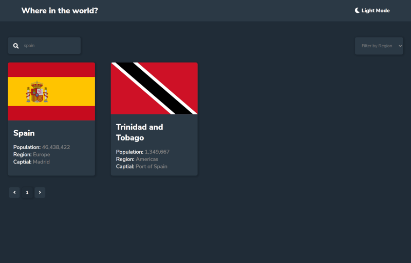
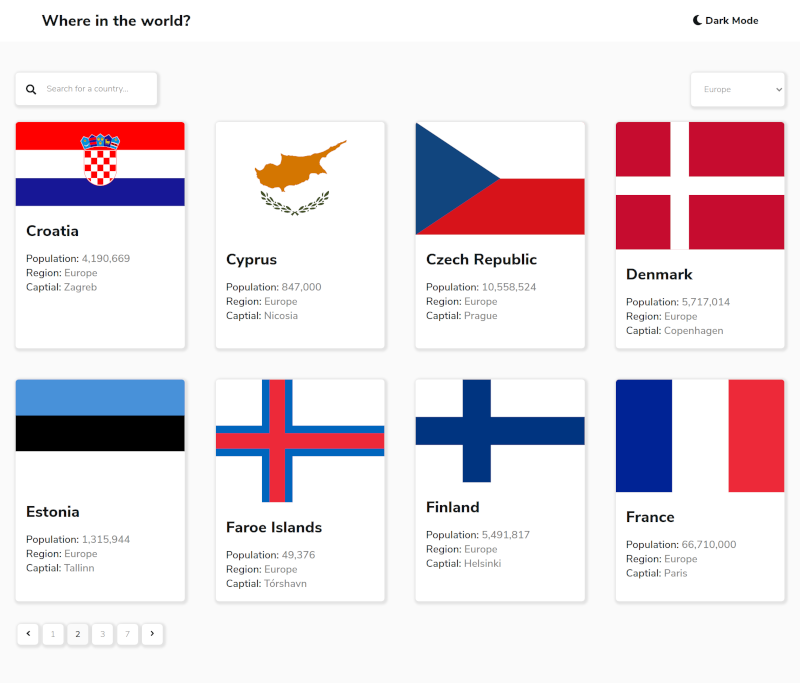
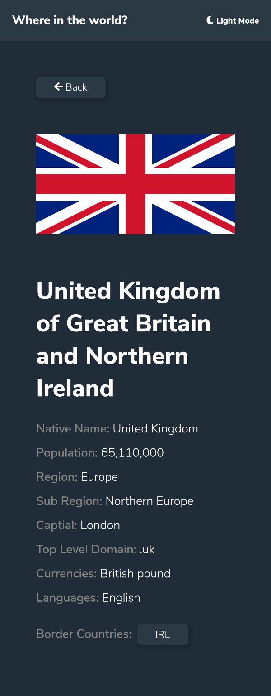
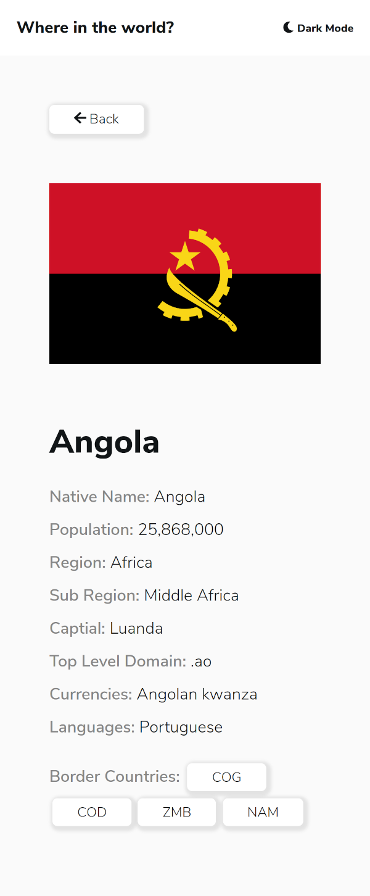

# Frontend Mentor - REST Countries API with color theme switcher solution

This is a solution to the [REST Countries API with color theme switcher challenge on Frontend Mentor](https://www.frontendmentor.io/challenges/rest-countries-api-with-color-theme-switcher-5cacc469fec04111f7b848ca). Frontend Mentor challenges help you improve your coding skills by building realistic projects.

## Table of contents

-   [Overview](#overview)
    -   [The challenge](#the-challenge)
    -   [Screenshot](#screenshot)
    -   [Links](#links)
-   [My process](#my-process)
    -   [Built with](#built-with)
    -   [What I learned](#what-i-learned)
    -   [Continued development](#continued-development)
    -   [Useful resources](#useful-resources)
-   [Author](#author)
-   [Acknowledgments](#acknowledgments)

## Overview

Create a responsive web application that uses an API to fetch data to be displayed and navigated. The website feature multiple pages and Light/Dark mode selection. Interactivity will include a search field and drop down filter as well as links to further details.

### The challenge

Users should be able to:

-   See all countries from the API on the homepage
-   Search for a country using an `input` field
-   Filter countries by region
-   Click on a country to see more detailed information on a separate page
-   Click through to the border countries on the detail page
-   Toggle the color scheme between light and dark mode _(optional)_

### Screenshot

#### Desktop Dark Mode



#### Desktop Light Mode



#### Mobile Dark Mode



#### Mobile Light Mode



### Links

-   Solution URL: [Code](https://github.com/Ifouldm/flags-site)
-   Live Site URL: [Live Site](http://github.obidex.com/flags-site)

## My process

I decided to use Vue to further my skills in this technology and I thought this challenge was a good fit for a SPA (Single Page Application). I therefore started with the Vue CLI to create the Vue boilerplate. Using the techniques and layouts I have used in the previous sites I built the framework for the sites main page. Having worked extensivly with APIs I utilised my existing code to perform the API query, parse the data and create some state for the application. I then extracted some of the elements into seperate Vue components to a\) extend their functionality b\) Improve the reusability of the components and c\) Make the overall application structured and readable.

The components could then be styled individually using the Vue `scoped` while retaining the generalised styles of the application.

The initial API query returns a full dataset which is not too large so I opted to store this data and filter/query from state rather than request new data on each page change. This somewhat restricts the features and how new the data is but given the context I believe this was the best option.

## Project setup

```
npm install
```

#### Compiles and hot-reloads for development

```
npm run serve
```

#### Compiles and minifies for production

```
npm run build
```

#### Lints and fixes files

```
npm run lint
```

### Built with

-   Semantic HTML5 markup
-   CSS custom properties
-   Flexbox
-   Mobile-first workflow
-   [Vue](https://vuejs.org/) - Vue Framework
-   [Vue Router](https://router.vuejs.org/) - Vue Router

### What I learned

I even went beyond the scope of the project and implemented pagination so that the results could be navigated and visualised. I kept this component as generic as possible so that I can reuse it in the future.

Pagination component:

```html
<Pagination
    class="pagination"
    @pageChange="pageChange"
    :totalRecords="selectedCountries.length"
    :perPage="perPage"
/>
```

As you can see it takes the total number of records and a number of records per page as props and emits an event on page change. The paginator then displays the first page, last page, closest pages with the current page highlighted as well as next and previous.

### Continued development

There are various areas that could be improved, I did not link the border countries to their details page as my architecture did not allow for this to be implemented easily and this was not the focus of the project, however if I ever come back to this project I may redesign to accomodate this.

### Useful resources

For this project I mainly used my existing resources as well as the product documentation for Vue and Vue Router.

-   [Vue](https://vuejs.org/) - Vue Framework
-   [Vue Router](https://router.vuejs.org/) - Vue Router

## Author

-   Website - [Matthew Ifould](https://obidex.com)
-   Frontend Mentor - [@ifouldm](https://www.frontendmentor.io/profile/ifouldm)
-   Github - [ifouldm](https://github.com/ifouldm)

## Acknowledgments

[Coding Garden](https://coding.garden)
Coding Garden helped push me towards Vue and having seen the benefits of the framework I have to agree that it is several advantages over React. His tutorials also helped with several other aspects.
